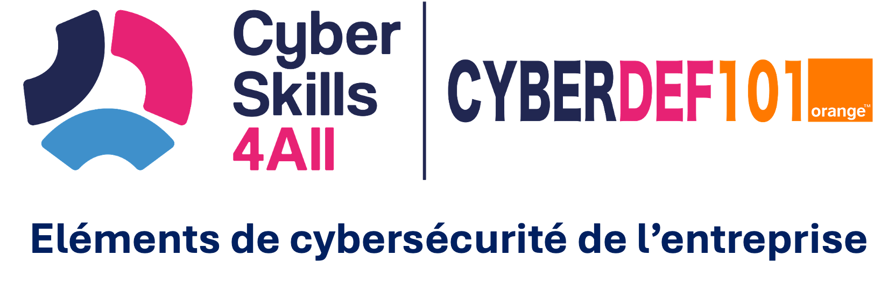

> Cyberdef101 (c) 2022-2025 - Production Orange Security School

# Eléments de Cybersécurité d'entreprise
Vous trouverez ici le cours CYBERDEF101 conçu pour les acteurs du commerce.

# Conférence introductive - CyberBootStrap

# Module 1 - Contexte et Environnement
>**S'exprimer dans le même langage que les acteurs du domaine.** 

La cybersécurité est devenue un enjeu majeur dans notre monde interconnecté. Ce chapitre vous plongera dans les fondements et l'évolution de cette discipline cruciale, en explorant ses origines, ses défis actuels et son organisation au sein des entreprises.
Nous commencerons par retracer l'histoire fascinante de la cybersécurité, depuis les premiers travaux en cryptologie jusqu'à l'émergence des réseaux informatiques et l'apparition des premiers virus. Vous découvrirez comment le virus Creeper, apparu en 1971, a marqué le début de l'ère de la cybercriminalité [(Ref 1)](https://www.perplexity.ai/search/peux-tu-me-faire-un-texte-intr-N2yV4VTgScaVay9kj.xufg).
Ensuite, nous examinerons les différents types de cybermenaces et leurs auteurs, allant des hackers éthiques aux criminels informatiques en passant par les acteurs étatiques26. Nous analyserons leurs motivations et les techniques qu'ils emploient pour compromettre la sécurité des systèmes.
Nous explorerons également les principaux types et vecteurs d'attaques, tels que les identifiants compromis, les logiciels malveillants et l'ingénierie sociale3. Cette partie vous permettra de mieux comprendre les vulnérabilités exploitées par les cybercriminels.
Un focus particulier sera fait sur le Darkweb et le Darkbusiness, ces zones obscures d'Internet où se déroulent de nombreuses activités illicites [(ref)](https://www.cyber.gc.ca/fr/orientation/introduction-lenvironnement-de-cybermenaces). Nous verrons comment les entreprises peuvent se protéger contre les menaces émanant de ces espaces.
Enfin, nous aborderons l'organisation de la sécurité en entreprise, en mettant l'accent sur les rôles clés du directeur sécurité et du RSSI (Responsable de la Sécurité des Systèmes d'Information). Vous comprendrez ainsi comment les organisations structurent leur défense face aux cybermenaces croissantes.
Ce chapitre vous fournira une base solide pour appréhender les enjeux de la cybersécurité dans notre société numérique en constante évolution.

- Histoire de la cybersécurité: cryptologie, sécurité réseau, premiers virus
- Cybermenaces et leurs auteurs: cybercriminalité, cyberguerre
- Types et vecteurs d'attaques
- Darkweb et Darkbusiness
- Organisation de la sécurité en entreprise: rôles du directeur sécurité et du RSSI
  
>***Compétences acquises***: compréhension de l'écosystème cyber, connaissance des menaces actuelles, familiarisation avec le jargon du domaine

# Module 2 - Risques numériques
>**Déterminer les évènements redoutés de l’entreprise**

- Définitions et référentiels de gestion des risques
- Les risques liés au numérique (IOT, Cloud, IA...)
- Concepts clés: impacts, biens primordiaux, menaces, scénarios
- Cadres normatifs: ISO 27005, intégration dans SMSI
- Des risques aux objectifs de sécurité: risques résiduels, PDCA
- Veille sécurité: CERT (Vulnérabilités, menaces), DarkWeb, IES, OSINT
>***Compétences acquises***: capacité à déterminer les événements redoutés, compréhension des méthodologies d'analyse de risques 
# Module 3 - Architectures et technologies
>**Appréhender la réalité technologique de l'environnement cyber d’une entreprise**

|Présentation|Notes de cours|
|---|---|
| |     |

# Module 4 - Management de la sécurité
>**Appréhender les enjeux de conformité et de pilotage d’une entreprise**

- Contraintes légales: OIV, OSE, RGPD, NIS 2, LPM
- Construction de la Politique de sécurité (PSSI)
- Système de Management de la Sécurité de l'Information (SMSI): ISO 27001, ISO 27002
- Audit de conformité et indicateurs
- Gestion de la continuité d'activité: ISO 22301, BCP, PRA

>***Compétences acquises***: compréhension des enjeux de conformité, capacité à définir une politique de sécurité conforme aux normes.

# Module 5 - La sécurité opérationnelle
>**S'avoir s'insérer dans l'organisation de la Cyberdéfense de l'entreprise** 

- Vulnerability Management: audit, pentest, CERT
- Threat Management: techniques d'attaques, SIEM, Threat Intelligence
- Incident Management: CSIRT, gestion des incidents, analyse forensique
- Gestion de crise Cyber
>***Compétences acquises**: compréhension de la sécurité opérationnelle, connaissance des processus de gestion des vulnérabilités, menaces et incidents.

# Module 6 - La sécurité dans les projets
>**Différentier la sécurité dans les projets et la sécurité de l'entreprise**

Ce chapitre vous guidera à travers les principes fondamentaux qui permettent de construire et de maintenir des systèmes sécurisés dès leur conception.
Nous commencerons par explorer le concept de "Security By Design", une approche proactive qui intègre la sécurité dès les premières étapes du cycle de développement. Vous découvrirez les méthodologies qui permettent d'anticiper les menaces et de concevoir des systèmes intrinsèquement sécurisés, plutôt que d'ajouter des couches de sécurité a posteriori.
Ensuite, nous plongerons dans les règles techniques de sécurisation et de durcissement. Ces pratiques essentielles visent à réduire la surface d'attaque des systèmes en éliminant les vulnérabilités connues et en renforçant les configurations par défaut. Vous apprendrez comment appliquer ces principes à différents niveaux : systèmes d'exploitation, applications, réseaux et infrastructures.
L'organisation de la sécurité dans les projets sera notre prochain sujet. Nous examinerons comment intégrer efficacement les considérations de sécurité tout au long du cycle de vie d'un projet, de la phase de conception à la maintenance, en passant par le développement et le déploiement.
La protection des données sensibles, un enjeu crucial à l'ère du Big Data et du RGPD, fera l'objet d'une attention particulière. Nous aborderons les techniques de chiffrement, de gestion des accès et de classification des données pour garantir leur confidentialité, leur intégrité et leur disponibilité.
Enfin, nous explorerons les normes et certifications qui attestent de la conformité des produits en matière de sécurité. Vous vous familiariserez avec la Certification de Sécurité de Premier Niveau (CSPN) et les Critères Communs, des standards reconnus qui permettent d'évaluer et de valider le niveau de sécurité des produits informatiques.

- Security By Design: concepts et méthodologies
- Règles techniques de sécurisation et durcissement
- Organisation de la sécurité dans les projets
- Sécurité des données sensibles
- Conformité des produits: CSPN, critères communs
- 
>***Compétences acquises***: différenciation entre sécurité dans les projets et sécurité de l'entreprise, connaissance des règles de sécurisation.

# Module 7 - Le marché de la sécurité
>**Se positionner dans l’écosystème cyber du marché.**
Le chapitre "Le marché de la cybersécurité" explore les dynamiques économiques, stratégiques et organisationnelles du marché de la cybersécurité. Dans un contexte où les menaces numériques se multiplient et où la transformation digitale s'accélère, il est essentiel de comprendre les acteurs clés, les tendances du marché, et les événements structurants qui façonnent cet écosystème. Ce chapitre vise à fournir une vision complète des forces en présence, des opportunités, et des défis dans le domaine de la cybersécurité.

- Acteurs de référence: éditeurs, ESN, opérateurs, régulateurs
- Évaluation du marché: CyberRating, prestataires qualifiés ANSSI
- Analyse de la concurrence et évolution du marché
- Grands événements: FIC, ECW, Assises, CTF
- Associations professionnelles: CESIN, CLUSIF
  
>***Compétences acquises***: positionnement dans l'écosystème cyber du marché, compréhension des acteurs et des tendances

# Synthèse
> Vous trouverez ici le document complet des notes de cours
> 