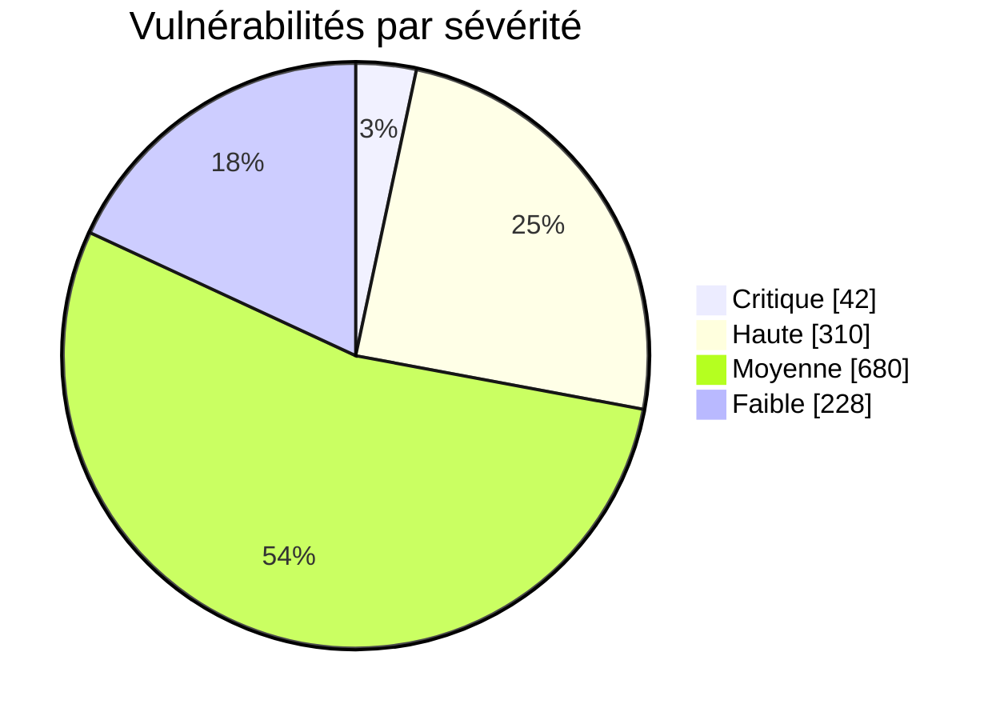
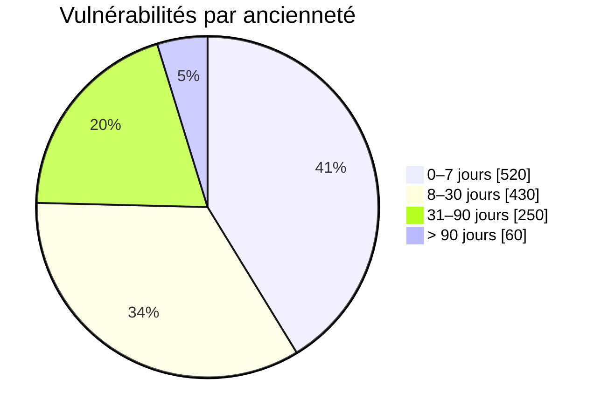
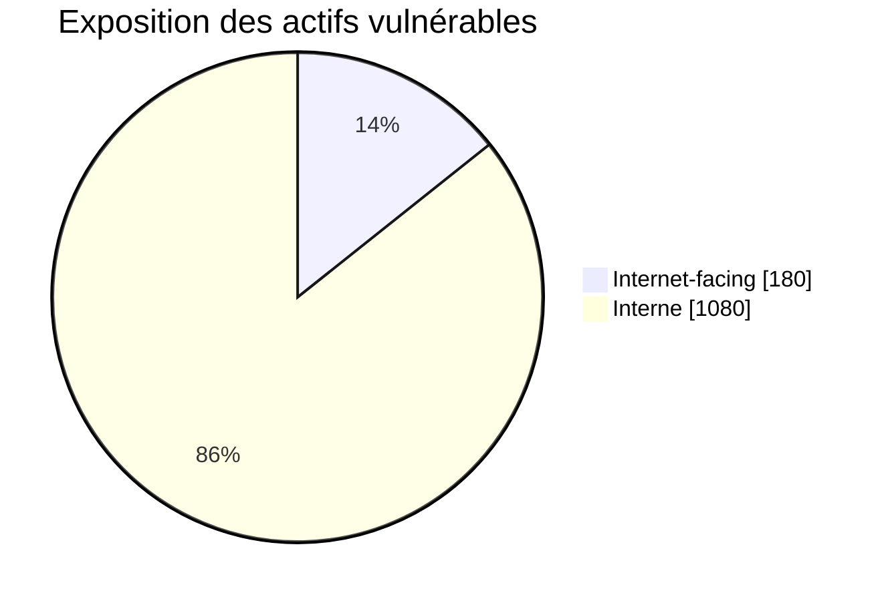
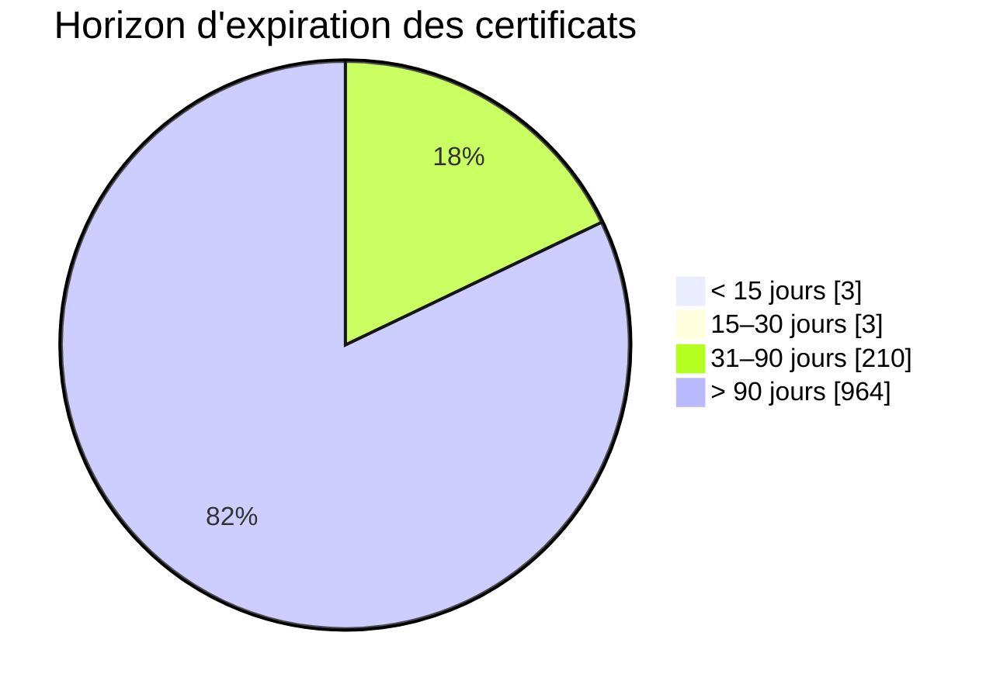
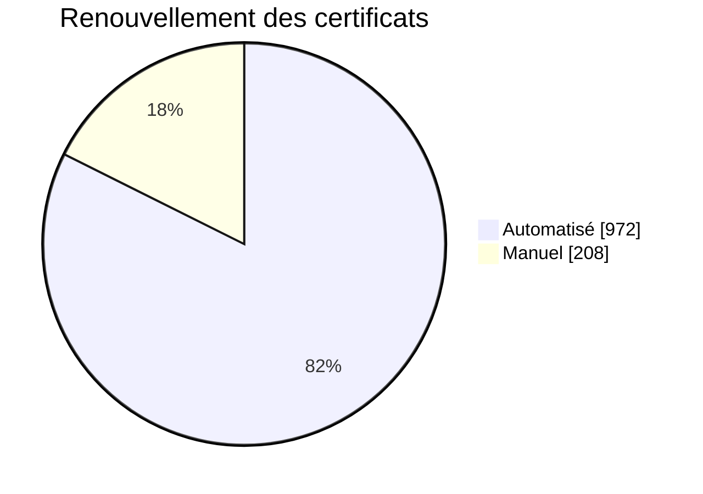
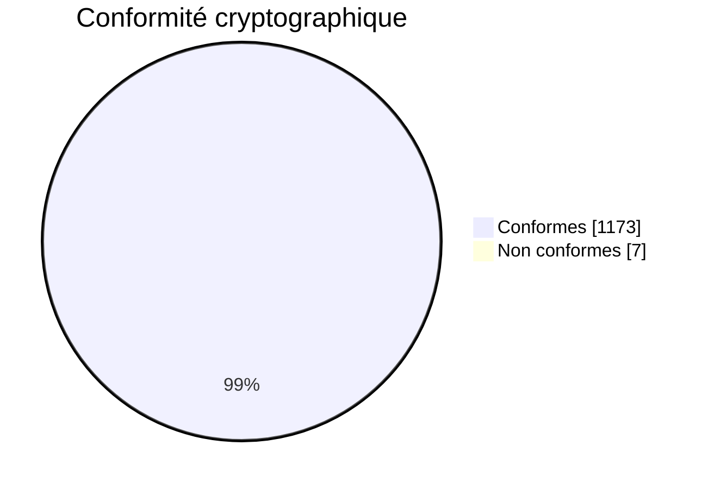

## Vulnérabilités

### KPIs clés — Vulnérabilités (valeurs fictives)

| KPI | Valeur | Cible | Statut | Tendance |
|---|---:|---:|:--:|:--:|
| Couverture des scans (30j) | 96,8% | ≥ 95% | 🟢 | ↑ |
| MTTR remédiation (Critiques) | 18 j | ≤ 15 j | 🟠 | ↑ (mieux) |
| Backlog vulnérabilités critiques > 30j | 12 | 0 | 🔴 | ↓ (pire) |
| Vulnérabilités KEV non corrigées | 7 | 0 | 🔴 | ↑ (mieux) |
| Respect des SLA de patching | 91% | ≥ 95% | 🟠 | ↑ (mieux) |
| Actifs hors support (EOL/EOS) | 3,1% | ≤ 2% | 🟠 | → |

Légende statut: 🟢 Vert | 🟠 Orange | 🔴 Rouge

### Camemberts — Vulnérabilités (fictif)

Vulnérabilités par sévérité (Total: 1 260)

Vulnérabilités par ancienneté

Surface d’exposition

Répartition Backlog «Critiques >30j» par BU
| BU | Nb |
|---|---:|
| Finance | 5 |
| Logistique | 4 |
| Siège | 2 |
| Autres | 1 |

---

## PKI

### KPIs clés — PKI (valeurs fictives)

| KPI | Valeur | Cible | Statut | Tendance |
|---|---:|---:|:--:|:--:|
| Certificats expirant < 30 j | 6 | 0 | 🟠 | ↑ (mieux) |
| Couverture inventaire des certificats | 97,2% | ≥ 98% | 🟠 | ↑ (mieux) |
| Conformité crypto (RSA≥2048/ECC P‑256; SHA‑256+) | 99,4% | 100% | 🟠 | ↑ (mieux) |
| Renouvellements automatisés | 82% | ≥ 90% | 🟠 | ↑ (mieux) |
| Incidents liés à certificat expiré | 0 | 0 | 🟢 | → |
| Clés haut risque en HSM/TPM | 96% | 100% | 🟠 | → |

Légende statut: 🟢 Vert | 🟠 Orange | 🔴 Rouge

### Camemberts — PKI (fictif)

Certificats par horizon d’expiration (Total: 1 180)

Mode de renouvellement

Conformité cryptographique

### Top 5 certificats expirant (< 30 jours)

| Service / CN | Plateforme | Jours restants | Propriétaire |
|---|---|---:|---|
| api.company.com | F5 | 12 | WebOps |
| vpn.company.com | ASA | 17 | NetSec |
| payroll.intra | IIS | 9 | HR IT |
| crm-ext.company.com | NGINX | 28 | Sales IT |
| mq-bus01 | Java Keystore | 21 | Integration |

---

## Notes rapides d’exploitation
- Données vulnérabilités: Scanner (Tenable/Qualys/Rapid7) + CMDB; KEV via flux CISA.
- Données PKI: PKI interne + scans TLS + CT logs; renouvellements via ACME/SCEP/MDM.
- Si Mermaid n’est pas supporté: utilisez ces répartitions pour générer des graphiques dans votre outil (Grafana/Power BI) ou insérez des images exportées.